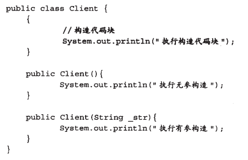

共有四种java代码块，分别为

###1. 普通代码块
在方法或预计中出现的{}就是普通代码块，执行顺序和一般的语句由他们在代码中出现的先后顺序决定。
###2. 静态代码块
使用static关键字声明的代码块，静态代码块用于初始化类，为类的属性初始化，只执行一次。由于静态代码块在实例化类的时候执行，所以它是先于主方法执行的。
###3. 同步代码块
使用synchronized关键字修饰的代码块，在同一时间只能有一个线程进入到该代码块中，是一种多线程保护机制。
###4. 构造代码块
在类中没有任何的前后缀，使用{}括起来的代码块。

构造代码块有如下特性：
1. 执行默认会添加到构造方法的第一句，如下代码


相当于下面


所以，当有需要在每个构造方法里都执行一段代码时，可以写成一个方法来调用，但是采用构造代码块的方式是更合适的。

2. 另外，在当有些构造方法通过this关键字来调用其他构造方法时，构造代码块只执行一次，下面是一个统计生成实例化对象个数的示例代码（其结果为输出3）：
```java
public class Test {
    public static void main(String[] args) {
        new Base();
        new Base("");
        new Base(0);
        System.out.println("===实例化对象个数====>>>：" + Base.getNumOfObjects());
    }
}

class Base {
    // 实例化对象的个数
    private static int numOfObjects = 0;
    {
        numOfObjects++;
    }

    public Base() {

    }

    public Base(String str) {
        super();
    }

    public Base(int i) {

    }

    public static int getNumOfObjects() {
        return numOfObjects;

    }
}
```
